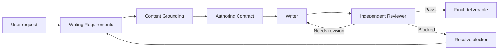
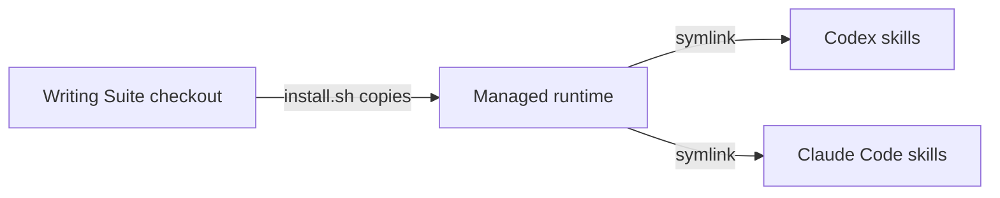

# Writing Suite

Writing Suite is a portable, repository-local workflow for producing grounded,
review-ready written artifacts with Claude Code or Codex.

It is suitable for repository README files, reports, memos, proposals, emails,
posts, and technical designs. The suite itself is the workflow and instruction
bundle; it is not a hosted service.

## Why it exists

An agent can produce fluent writing before the task itself is clear, the needed
information is grounded, or the boundary between fact and invention has been
decided. That makes a document look finished while leaving its requirements,
evidence, or ownership unclear.

Writing Suite adds a small operating layer around the agent. It turns a request
into explicit requirements, prepares only the content needed to satisfy them,
records what the Writer may use or add, and brings in an independent Reviewer
before the artifact is considered complete. The goal is straightforward:
make good writing easier to produce and easier to trust without making every
writing task a large process.

In practical terms, the suite helps answer four questions:

- What exactly does this artifact need to accomplish?
- Which content is supported by the available sources?
- What may the Writer infer, correct, or create?
- What still needs revision before the artifact is finished?

The suite sits between the user’s request and the agent’s final deliverable by
making those decisions explicit and durable.

## Workflow



The suite keeps compact state for each artifact in the project that owns the
deliverable:

```text
.writing/
├── registry.md
└── <artifact-name>/
    ├── requirements.md
    ├── grounding.md
    ├── authority.md
    └── review.md
```

The final artifact remains at its requested project path. The Reviewer writes
review state but does not edit the deliverable; the Writer performs drafting
and revisions.

## Installation

Clone or otherwise obtain this repository, then run the installer from the
checkout:

```bash
./install/install.sh
```

The installer detects Claude Code and Codex. With interactive terminal input it
offers a selection menu. For automation or other non-interactive environments,
select the client explicitly:

```bash
./install/install.sh --claude --yes
./install/install.sh --codex --yes
./install/install.sh --all --yes
```

If no client-selection flag is supplied without interactive input, the command
exits successfully without changing the filesystem. Use `--claude`, `--codex`,
or `--all` in that situation.

### Where installation lives

The installer copies the portable suite runtime to:

```text
${XDG_DATA_HOME:-$HOME/.local/share}/writing-suite/current
```

It then creates a `writing-suite` symlink for each selected client:

| Client | Default skill path |
|---|---|
| Claude Code | `${CLAUDE_CONFIG_DIR:-$HOME/.claude}/skills/writing-suite` |
| Codex | `$HOME/.agents/skills/writing-suite` |

The managed copy contains the suite entry point, stage skills, standards,
standards registry, and templates. Existing real files, directories, foreign
symlinks, and broken symlinks at client targets are not replaced.



## Use the suite

Start with [`SKILL.md`](SKILL.md), the canonical entry point. When an agent
handles a writing request, it loads only the stage instructions, runtime state,
selected standards, and applicable reviewer checks needed for that artifact.

The workflow uses [`standards-registry.md`](standards-registry.md) to select
reusable guidance. Universal writing rules always apply. A genre such as the
[README standard](standards/genres/readme.md) applies when the artifact is a
repository README. A channel standard applies only when the artifact will be
delivered through that channel.

## Update an installation

The source checkout is the source of truth for changes. To update an installed
suite:

```bash
# Optional: bring changes from the remote checkout
git pull

# Reinstall the edited checkout for the desired client(s)
./install/install.sh --codex --yes
```

Use `--claude --yes` or `--all --yes` as appropriate. You do not need to clone
again when the checkout is already current. The installer refreshes the managed
copy, while the client symlinks continue to point to that managed location.

To add a reusable skill, standard, or template, add it in the corresponding
source directory. When adding a reusable standard, also add one row for it to
[`standards-registry.md`](standards-registry.md) so the Writer and Reviewer can
select it. Re-run the installer after source changes.

Avoid treating the managed copy under `.local/share` as the editable source;
those edits can be replaced by the next installation. Edit the checkout and
reinstall instead.

## Verify and uninstall

Check the source bundle, managed runtime, manifest checksums, and client links:

```bash
./install/verify.sh
```

Remove only the managed client links:

```bash
./install/uninstall.sh --claude
./install/uninstall.sh --codex
./install/uninstall.sh --all --yes
```

The uninstaller does not remove files that are not managed Writing Suite links.
With `--yes`, it retains the managed runtime after removing the selected links.

## Scripts

| Script | Purpose |
|---|---|
| [`install/install.sh`](install/install.sh) | Detect clients, install the managed runtime, and create client links. |
| [`install/verify.sh`](install/verify.sh) | Validate the source bundle, managed copy, checksums, and links. |
| [`install/uninstall.sh`](install/uninstall.sh) | Remove managed client links with conservative conflict handling. |
| [`install/common.sh`](install/common.sh) | Shared implementation used by the three user-facing scripts. |

The installer and uninstaller support `--help`. Installation supports
`--claude`, `--codex`, `--all`, and `--yes`; uninstall uses the same
client-selection flags and `--yes` policy.

## Repository map

```text
SKILL.md                         Canonical workflow and orchestration
skills/                          Requirements, grounding, authority, writing, and review skills
standards-registry.md            Index of reusable writing standards
standards/                       Universal, genre, and channel standards
templates/                       Runtime-state templates
install/install.sh               Installation entry point
install/verify.sh                Installation verification
install/uninstall.sh             Managed-link removal
```
