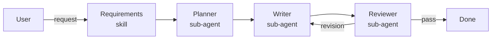
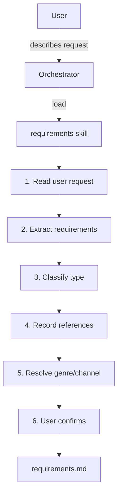
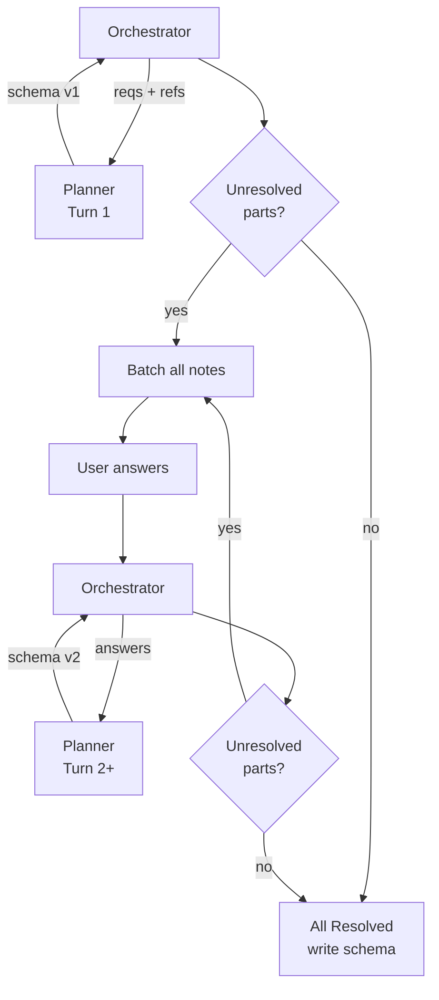
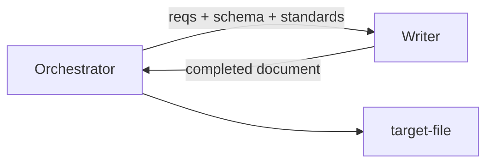
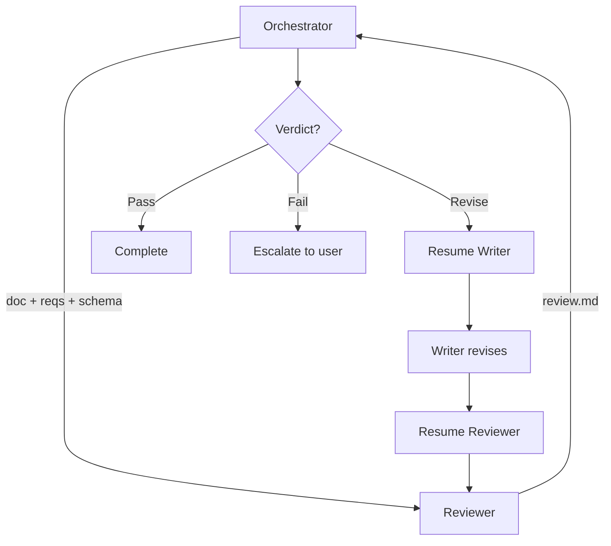
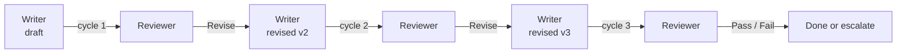
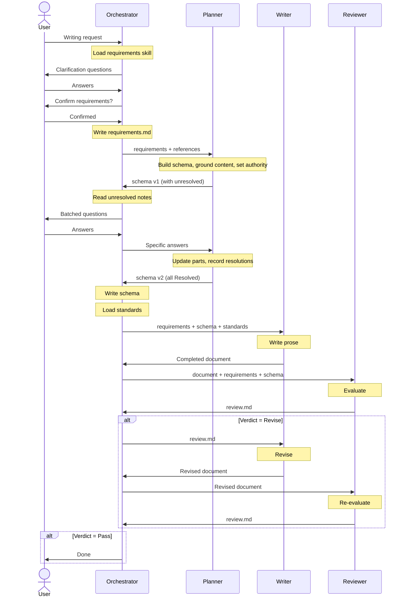
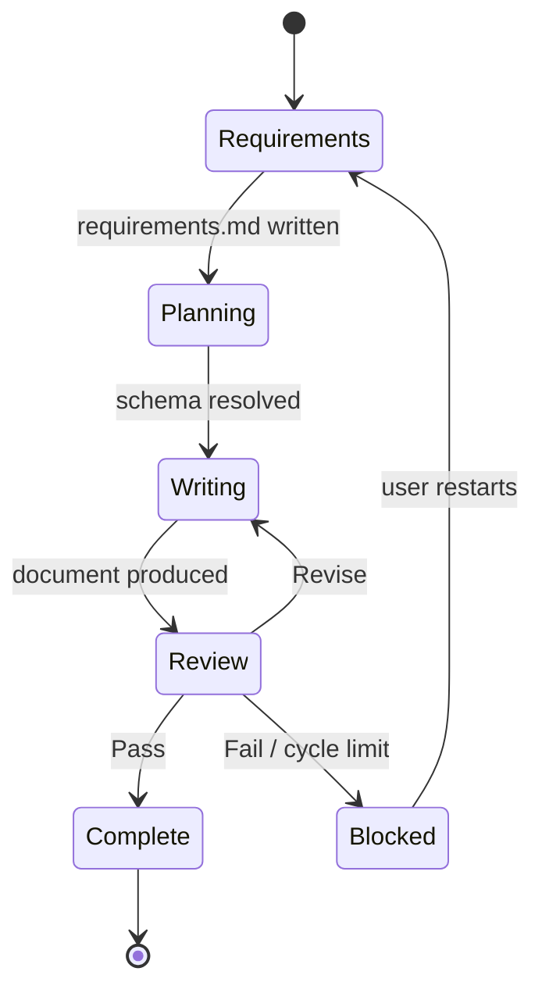

# Orchestration Flow

> Task: [#151](https://github.com/pradeepdas/vid/issues/151)
> Story: [#147 Planning](https://github.com/pradeepdas/vid/issues/147)

This document describes the complete orchestration flow of the Draft Agent system — how the orchestrator coordinates the pipeline from user request to finished document.

---

## 1. End-to-end pipeline



The pipeline has four stages. Each stage completes before the next begins. The orchestrator controls all transitions.

---

## 2. Stage 1: Requirements

**Mode:** Orchestrator works directly with the user (no sub-agent).



### What happens

1. The orchestrator loads the requirements skill.
2. The user describes what they want written. They may provide reference files, links, data sources.
3. The orchestrator extracts requirements and records each one with:
   - An ID (`RQ-01`, `RQ-02`, ...)
   - The requirement text
   - A type: Identity, Constraint, or Topic
   - References (files, links, templates) if any
4. For Identity requirements that specify a genre or channel, the orchestrator checks `standards-registry.md` to verify the genre/channel standard exists. If it doesn't, the orchestrator resolves this with the user (pick a different genre, or proceed without a genre standard).
5. The orchestrator presents the requirements table to the user for confirmation.
6. The skill is unloaded. The requirements are written to `.draft/<artifact>/requirements.md`.

### Exit condition

The user confirms the requirements table. All genre/channel references are resolved.

---

## 3. Stage 2: Planning

**Mode:** Orchestrator launches Planner sub-agent. Multi-turn via relay.



### Turn 1: Initial planning

1. The orchestrator sends `requirements.md` content and all reference file contents to the Planner via `sys_session_send`.
2. The Planner reads the references and builds a document schema — a sequence of parts. For each part it:
   - Links to the requirements it serves (`<serves>`)
   - Writes specification bullets describing what content goes here and how (`<specification>`)
   - Sets authority boundaries describing what the Writer may and may not do (`<authority>`)
   - Marks the part Resolved or Unresolved (`<status>`)
   - If Unresolved, writes notes explaining what needs resolution (`<notes>`)
3. The Planner returns the complete schema to the orchestrator.

### Resolution loop

4. The orchestrator reads all Unresolved parts and collects their notes.
5. The orchestrator presents ALL questions to the user in one batch — not one at a time. This minimizes user interruptions.
6. The user answers.
7. The orchestrator resumes the Planner with the specific answers (not with updated requirements).

### Turn 2+: Resolution

8. The Planner receives the answers and updates the affected parts:
   - Adds new specification bullets reflecting the resolved information
   - Updates authority if the answer changes permission boundaries
   - Changes status to Resolved
   - Records the resolution in notes (prefixed with `RESOLVED:`)
9. The Planner may discover new unresolved items during this update. If so, it returns them.
10. The loop continues until all parts are Resolved.

### Key design decisions in this stage

**Answers are NOT recorded as new requirements.** The user's answers to Planner questions are clarifications about execution ("use $4.2M, not $4.5M"), not changes to intent. They go directly to the Planner and are recorded in the schema's specification and notes — not in requirements.md.

**Exception:** If the user's answer fundamentally changes the scope ("remove all revenue sections, write about product features instead"), the orchestrator updates requirements.md and re-runs the Planner from scratch. This is a new task, not a loop iteration.

**The Planner runs in a persistent session.** The orchestrator resumes the same Planner session on each turn. The Planner retains context from previous turns and updates specific parts rather than rebuilding the entire schema.

### Exit condition

Every part in the schema has `<status>Resolved</status>`. The schema is written to `.draft/<artifact>/schema`.

---

## 4. Stage 3: Writing

**Mode:** Orchestrator launches Writer sub-agent. Single turn (unless review requires revision).



### What happens

1. The orchestrator loads the applicable writing standards based on Identity requirements:
   - Universal standard (always loaded)
   - Genre standard (if requirements specify a genre)
   - Channel standard (if requirements specify a channel)
2. The orchestrator sends requirements.md, the resolved schema, and the standards to the Writer.
3. The Writer reads the full requirements for context (identity, constraints, topics).
4. For each schema part, the Writer reads the specification (what to write) and authority (what's allowed).
5. The Writer produces the complete document and returns it to the orchestrator.
6. The orchestrator writes it to the target file.

### Exit condition

The Writer returns a complete document.

---

## 5. Stage 4: Review

**Mode:** Orchestrator launches Reviewer sub-agent. May trigger Writer-Reviewer loop.



### Writer-Reviewer loop



Maximum N cycles (e.g., 3). If the Reviewer still says Revise after N cycles, the orchestrator escalates to the user.

### What happens

1. The orchestrator sends the document, requirements.md, and schema to the Reviewer.
2. The Reviewer evaluates the document and produces review.md with:
   - A verdict: Pass, Revise, or Fail
   - Findings with severity (Critical, Major, Minor)
3. If **Pass**: the pipeline is complete. The orchestrator writes review.md and marks the artifact as done in the registry.
4. If **Revise**: the orchestrator resumes the Writer with review.md. The Writer revises the document. The orchestrator resumes the Reviewer with the revised document. This repeats up to N cycles.
5. If **Fail** (or Revise after N cycles): the orchestrator escalates to the user for guidance.

### Exit condition

Reviewer verdict is Pass, or the revision loop reaches the cycle limit and the user decides how to proceed.

---

## 6. Complete pipeline sequence diagram



---

## 7. Error handling and edge cases

### User changes scope during planning

If the user's answer to a Planner question fundamentally changes what the document should be (not just clarifying a detail), the orchestrator:
1. Updates requirements.md with the new/changed requirements
2. Terminates the current Planner session
3. Starts a new Planner session with the updated requirements

This is rare. Most user answers are clarifications that the Planner incorporates without re-planning.

### Planner cannot resolve an item

If the Planner marks an item Unresolved and the user cannot answer (e.g., "I don't have that data"), the orchestrator and user decide:
- Remove the requirement (update requirements.md, re-plan)
- Proceed without it (Planner marks the part as Resolved with a specification noting the gap)
- User provides the data later (pause the pipeline)

### Writer discovers an issue not caught by planning

If the Writer encounters a problem during writing (e.g., two specification bullets in the same part contradict each other), it reports the issue to the orchestrator. The orchestrator may:
- Resolve it with the user directly
- Resume the Planner to fix the schema
- Instruct the Writer how to proceed

### Review cycle limit reached

If the Writer-Reviewer loop reaches N cycles without a Pass verdict, the orchestrator presents the latest review.md to the user and asks how to proceed:
- Accept the current draft as-is
- Provide specific guidance for another revision
- Abandon and start over

---

## 8. Registry management

The orchestrator owns `.draft/registry.md`, which tracks all artifacts in the project:

```
| Artifact | Target file | Stage | Review |
|----------|------------|-------|--------|
| q2-blog  | blog/q2-revenue.md | Writing | — |
```



The orchestrator updates the Stage column as the pipeline progresses through these states.

---

## Related documents

- [`docs/discussion.md`](../discussion.md) — Full design discussion with rationale
- [`docs/planning/study-skill-phases.md`](./study-skill-phases.md) — Study of current skill phases
- [`docs/planning/architecture.md`](./architecture.md) — Multi-agent architecture definition
- [`docs/planning/phase-agent-mapping.md`](./phase-agent-mapping.md) — How phases map to agents
