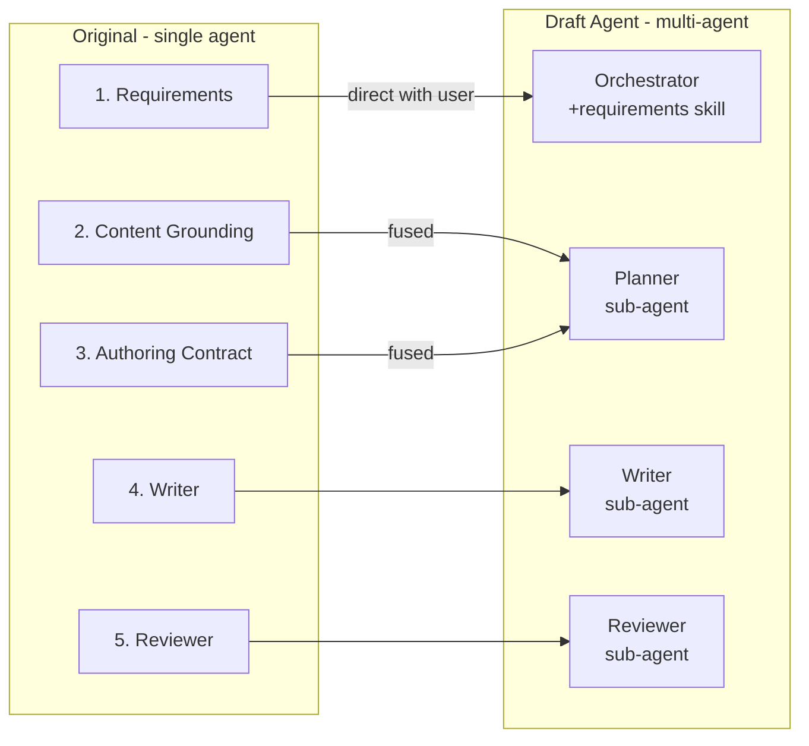

# Phase-to-Agent Mapping

> Task: [#150](https://github.com/pradeepdas/vid/issues/150)
> Story: [#147 Planning](https://github.com/pradeepdas/vid/issues/147)

This document traces how each phase in the original single-agent Writing Suite maps to the multi-agent Draft Agent system. It explains what changed, what was absorbed, and why.

---

## 1. The mapping at a glance

Five phases become four agents. Three phases (Grounding, Authority, and the new Planning concern) fuse into one.

---

## 2. Phase 1: Requirements → Orchestrator

### What changed

The requirements phase stays with the orchestrator instead of becoming a sub-agent.

### Why

Requirements gathering is a conversation with the user. The orchestrator is the only agent that can talk to the user. Making requirements a sub-agent would mean every clarification question routes through relay: sub-agent → orchestrator → user → orchestrator → sub-agent. Since requirements gathering is almost entirely user Q&A, the relay overhead would exceed the benefit of isolation.

### How it works now

The orchestrator loads a **skill** (`skills/requirements/SKILL.md`) when entering the requirements phase. The skill provides instructions on:

- How to extract requirements from the user's request
- How to categorize each requirement by type (Identity, Constraint, Topic)
- How to record references (source files, links, templates)
- How to resolve genre and channel against `standards-registry.md`
- When to ask for clarification vs when to proceed

The skill is unloaded after requirements are complete. This is progressive context disclosure — the orchestrator's always-on prompt stays lean, and phase-specific instructions load only when needed.

### Output

`requirements.md` — a table with four columns:

| Column | Contains |
|--------|----------|
| ID | Stable identifier: `RQ-01`, `RQ-02`, etc. |
| Requirement | What the user wants, stated as an actionable requirement |
| Type | `Identity` (genre, audience, tone, style), `Constraint` (limits, rules, prohibitions), or `Topic` (content items, sections, data to include) |
| References | Source files, links, templates, standards that this requirement points to. Empty if none. |

Requirements are **records, not work items**. They have no state column. They capture user intent and do not change during downstream processing (except in rare cases where user answers fundamentally change the scope).

---

## 3. Phases 2+3 → Planner (fused with new Planning concern)

### What changed

Three concerns merge into one sub-agent:

| Original concern | What it did | Where it goes |
|-----------------|-------------|---------------|
| Content Grounding (Phase 2) | Find and extract content from references | Planner: populates `<specification>` bullets from references |
| Authoring Contract (Phase 3) | Determine Writer permissions per item | Planner: populates `<authority>` boundaries per part |
| Planning (new) | Design the document structure | Planner: creates the part-based schema |

### Why the fusion

**Grounding + Planning:** These have a circular dependency. The document structure depends on what content is available. The content you need depends on the document structure. Stanford's STORM system proved that fusing research and planning eliminates this loop — the structure emerges from the content, not independently.

**Authority + Grounding:** Authority is a validation check on grounding output ("is this content ready? is it conflicting?"). When the same agent does grounding, authority assessment happens naturally as part of the work. The Planner reads a reference, extracts content, and immediately knows whether it's sufficient (Ready), contradictory (Conflict), or missing (needs user input). Recording this as a separate pass by a separate agent adds overhead without adding insight.

### How it works now

The Planner receives all requirements and references in one structured brief. It:

1. Reads the references
2. Designs a document schema as a sequence of **parts**
3. For each part, grounds content from references into specification bullets
4. For each part, sets authority boundaries (what's factual, domain knowledge, creative, prohibited)
5. Marks each part Resolved or Unresolved
6. Returns the complete schema to the orchestrator

If there are Unresolved parts, the orchestrator collects the notes, asks the user, and resumes the Planner with answers. This repeats until all parts are Resolved.

### Output

A document schema made of `<part>` elements. Each part has five tagged fields:

| Tag | Purpose |
|-----|---------|
| `<serves>` | Which requirement IDs this part fulfills |
| `<specification>` | Bulleted instructions for the Writer — what to write, using what data, in what framing |
| `<authority>` | Bulleted permission boundaries — FACTUAL, DOMAIN, CREATIVE, PROHIBIT |
| `<status>` | `Resolved` or `Unresolved` |
| `<notes>` | Questions (if Unresolved) or resolution records (if Resolved after clarification) |

### What the Planner does NOT do

- Does not write prose (that's the Writer)
- Does not talk to the user (questions go through the orchestrator)
- Does not modify requirements.md (owned by the orchestrator)

---

## 4. Phase 4: Writer → Writer (sub-agent)

### What changed

The Writer's scope **narrowed**. In the original system, the Writer received three files (requirements, grounding, authority) and had to synthesize them into a document structure and prose. In the multi-agent system, the Planner has already done the structural work. The Writer receives a resolved schema with per-part specifications and authority boundaries.

### How it works now

The Writer receives:
- Full `requirements.md` (for overall context — identity, constraints, topics)
- Resolved schema (per-part specifications and authority)
- Applicable writing standards (universal + genre + channel, loaded by orchestrator)

The Writer's creative freedom is **prose-level**: sentence construction, transitions, word choice, flow, narrative voice. Content-level decisions (what to include, what claims to make, what examples to use) are already made in the schema's specification bullets.

### What carries forward from the original Writer skill

| Element | Status |
|---------|--------|
| Standards application (universal, genre, channel) | Carries forward — standards loaded by orchestrator |
| Content fidelity (no inventing facts) | Carries forward — enforced by `<authority>` FACTUAL/PROHIBIT tags |
| Authorized augmentation (domain knowledge) | Carries forward — enabled by `<authority>` DOMAIN tags |
| Review-revision loop (bounded to 3 cycles) | Carries forward — orchestrator mediates |
| Reading three separate state files | Eliminated — replaced by schema |
| Deciding document structure | Eliminated — Planner does this |

---

## 5. Phase 5: Reviewer → Reviewer (sub-agent)

### What changed

The Reviewer remains a separate sub-agent. Its independence is important — it should evaluate the draft without being biased by the writing process.

### How it works now

The Reviewer receives:
- The draft document
- Full `requirements.md`
- The schema (to verify the Writer followed specifications and authority)

It produces `review.md` with a verdict and findings.

### Open items

The Reviewer's detailed check structure (10 checks, 5 with reference files) has not yet been redesigned for the multi-agent context. The current checks from `backup/skills/reviewer/references/checks/` need evaluation for what carries forward.

---

## 6. Summary table

| Original Phase | Original Agent | New Agent | Communication | Key Change |
|---------------|---------------|-----------|---------------|------------|
| 1. Requirements | Single agent (skill) | Orchestrator (skill) | Direct with user | Type column added; no state tracking |
| 2. Content Grounding | Single agent (skill) | Planner (sub-agent) | Via orchestrator relay | Fused with planning and authority |
| 3. Authoring Contract | Single agent (skill) | Planner (sub-agent) | Via orchestrator relay | Per-part authority tags replace global authority file |
| — (new) Planning | Did not exist | Planner (sub-agent) | Via orchestrator relay | Document schema design is new |
| 4. Writer | Single agent (skill) | Writer (sub-agent) | Via orchestrator | Narrower scope; receives resolved schema |
| 5. Reviewer | Single agent (skill) | Reviewer (sub-agent) | Via orchestrator | Largely unchanged; check redesign TBD |

---

## Related documents

- [`docs/discussion.md`](../discussion.md) — Full design discussion with rationale
- [`docs/planning/study-skill-phases.md`](./study-skill-phases.md) — Study of current skill phases
- [`docs/planning/architecture.md`](./architecture.md) — Multi-agent architecture definition
- [`docs/planning/orchestration-flow.md`](./orchestration-flow.md) — Orchestration flow documentation
