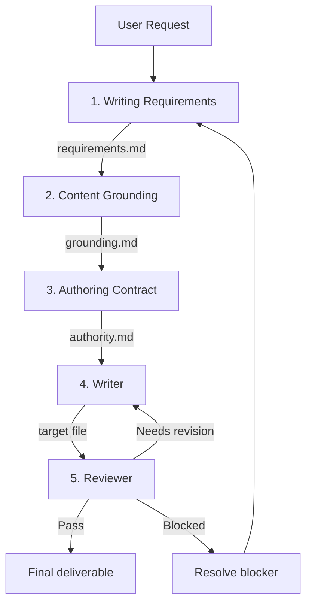
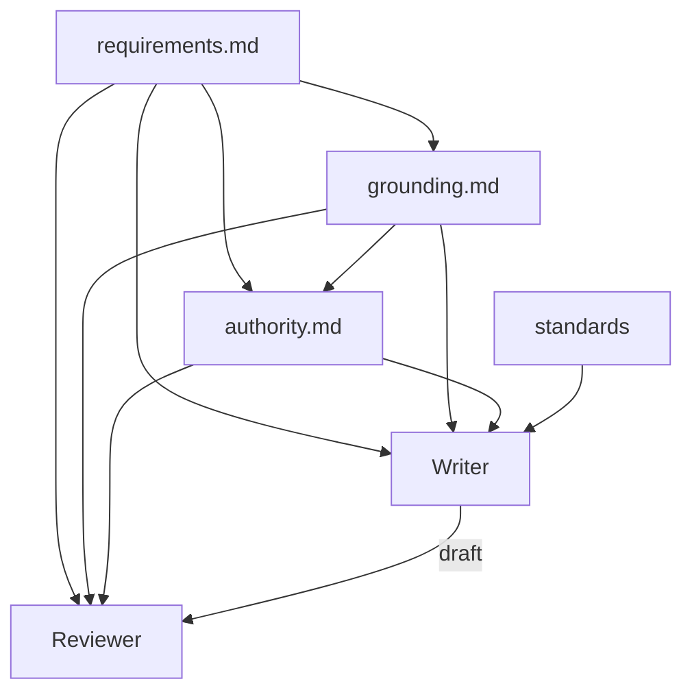

# Study: Writing Suite Skill Phases

> Task: [#148](https://github.com/pradeepdas/vid/issues/148)
> Story: [#147 Planning](https://github.com/pradeepdas/vid/issues/147)

This document studies the existing single-agent Writing Suite phases (in `backup/`), identifies what each phase does, and records the flaws that motivate the multi-agent redesign.

---

## 1. Current pipeline

The Writing Suite runs as **one agent** switching between five sequential phases using skill files. The orchestration logic lives in `backup/SKILL.md`.

---

## 2. Phase-by-phase study

### Phase 1: Writing Requirements

**File:** `backup/skills/writing-requirements/SKILL.md`

**What it does:**
- Extracts actionable writing requirements from the user's request
- Identifies: document type, audience, purpose, content scope, constraints, references
- Records authorship intent (is the user the author? ghost-writing? collaborative?)
- Produces a flat table: `ID | Requirement | Origin`

**State file:** `.writing/<artifact>/requirements.md` (template: `backup/templates/artifact/requirements.md`)

**Key characteristics:**
- Requirements are flat — no categorization by type (identity vs constraint vs topic)
- Origin tracks where each requirement came from (user request, reference document, etc.)
- The skill tells the agent to ask for clarification only under strict conditions

### Phase 2: Content Grounding

**File:** `backup/skills/content-grounding/SKILL.md`

**What it does:**
- For each requirement, determines what factual/contextual content is needed
- Reads user-provided references (files, links, data) to extract relevant content
- Records grounded content with source pointers (file paths, page numbers, URLs)
- Records gaps — requirements where no content could be found
- Handles derived requirements (when reading a reference reveals new constraints)

**State file:** `.writing/<artifact>/grounding.md` (template: `backup/templates/artifact/grounding.md`)

**Key characteristics:**
- The agent autonomously decides what information each requirement needs — this is where slop enters
- The skill explicitly says "do not ask the requester directly merely because information is missing"
- Grounded content table: `ID | Satisfies | Grounded content | Source`
- Gaps table: `Requirement | Unresolved information | Reason / next source`

### Phase 3: Authoring Contract

**File:** `backup/skills/authoring-contract/SKILL.md`

**What it does:**
- Determines what the Writer is **authorized** to do with each piece of content
- Assigns one of five authority states per item:
  - **Ready** — Writer may proceed (content grounded, or safe domain knowledge)
  - **Verify** — factual claim needs authoritative verification before use
  - **Ask** — only the user has this information (personal experience, org decisions)
  - **Creative** — invention is delegated (fiction, scenarios, examples)
  - **Conflict** — sources contradict or material appears incorrect
- Records source roles (authoritative, factual, structural, style, technical)
- Handles corrections to supplied material (non-consequential vs consequential)
- Enforces a readiness gate — blocks Writer until all items are resolved

**State file:** `.writing/<artifact>/authority.md` (template: `backup/templates/artifact/authority.md`)

**Key characteristics:**
- Authority decisions table: `ID | Applies to | State | Source role | Boundary/resolution`
- Overall readiness: Ready to write / Not ready (with blocking items)
- Resolution loop: can send items back to Grounding (Verify) or to user (Ask)

### Phase 4: Writer

**File:** `backup/skills/writer/SKILL.md`

**What it does:**
- Reads requirements, grounding, authority, and applicable writing standards
- Organizes content into a document structure
- Drafts the complete document
- Treats requirements as obligations, grounding as the factual base, authority as the permission boundary
- May use domain knowledge only within authority boundaries
- Handles review-revision loop (bounded to 3 cycles)

**Output:** The target file (the actual document)

**Key characteristics:**
- Loads applicable standards from `standards-registry.md` (universal + genre + channel)
- Content fidelity rules: cannot invent facts, cannot contradict sources, must preserve uncertainty
- Authorized augmentation: may add domain knowledge where authority permits
- Review loop: Writer revises based on Reviewer findings, up to 3 cycles

### Phase 5: Reviewer

**File:** `backup/skills/reviewer/SKILL.md`

**What it does:**
- Independently evaluates the draft against requirements, grounding, and authority
- Runs 10 checks (5 with detailed reference files):
  1. Factual accuracy (`references/checks/factual-accuracy.md`)
  2. Consistency (`references/checks/consistency.md`)
  3. Readability (`references/checks/readability.md`)
  4. Artifacts (`references/checks/artifacts.md`)
  5. AI writing patterns (`references/checks/ai-writing.md`)
  6. Requirement satisfaction
  7. Scope fidelity
  8. Structural soundness
  9. Authority compliance
  10. Standards compliance
- Produces a verdict: Pass, Revise, or Fail
- Each finding has a severity: Critical, Major, or Minor

**State file:** `.writing/<artifact>/review.md` (template: `backup/templates/artifact/review.md`)

**Key characteristics:**
- Read-only with respect to the deliverable — never edits the document
- Independent context — should not be biased by the writing process
- Review history tracked across cycles

---

## 3. State files and data flow

Each phase reads from the previous phase's output:
- Grounding reads requirements.md
- Authority reads requirements.md + grounding.md
- Writer reads requirements.md + grounding.md + authority.md + standards
- Reviewer reads requirements.md + grounding.md + authority.md + the draft

---

## 4. Identified flaws

These flaws motivate the multi-agent redesign. Full analysis in [`docs/discussion.md`](../discussion.md), Section 1.

| # | Flaw | Impact |
|---|------|--------|
| 1 | Skills designed for context switching, not agent boundaries | Unnecessary indirection in multi-agent |
| 2 | Three separate files create interleaving problems | Cross-file consistency is hard to maintain |
| 3 | Grounder has too much autonomous judgment | Silent decisions = slop vectors |
| 4 | Authority states are labels, not resolution drivers | Creative and Conflict items reach Writer unresolved |
| 5 | No requirement categorization | Curse of instructions; no priority for downstream agents |
| 6 | Human-in-the-loop is an afterthought | Agent decides first, asks user only when stuck |
| 7 | Skills contain verbose defensive instructions | Prompt bloat, redundancy, slop in the instructions themselves |
| 8 | Planning and grounding have circular dependency | Plan needs content, content needs plan |

---

## 5. What carries forward

| Element | Carries forward | Notes |
|---------|----------------|-------|
| Requirements concept | Yes | Simplified: flat table with Type column (Identity, Constraint, Topic) |
| Grounding concept | Yes | Absorbed into Planner agent — grounding happens during schema design |
| Authority concept | Yes | Absorbed into Planner agent — authority recorded per schema part |
| Writer | Yes | Becomes a sub-agent; receives resolved schema instead of three files |
| Reviewer | Yes | Becomes a sub-agent; design TBD |
| Standards registry | Yes | Loaded by orchestrator, passed to Writer/Reviewer |
| Review checks | TBD | Need evaluation for multi-agent context |
| Three separate state files | No | Replaced by requirements.md + schema |
| Skill-based phase switching | Partial | Only for orchestrator's requirements phase |

---

## Related documents

- [`docs/discussion.md`](../discussion.md) — Full design discussion with rationale
- [`docs/planning/architecture.md`](./architecture.md) — Multi-agent architecture definition
- [`docs/planning/phase-agent-mapping.md`](./phase-agent-mapping.md) — How phases map to agents
- [`docs/planning/orchestration-flow.md`](./orchestration-flow.md) — Orchestration flow documentation
